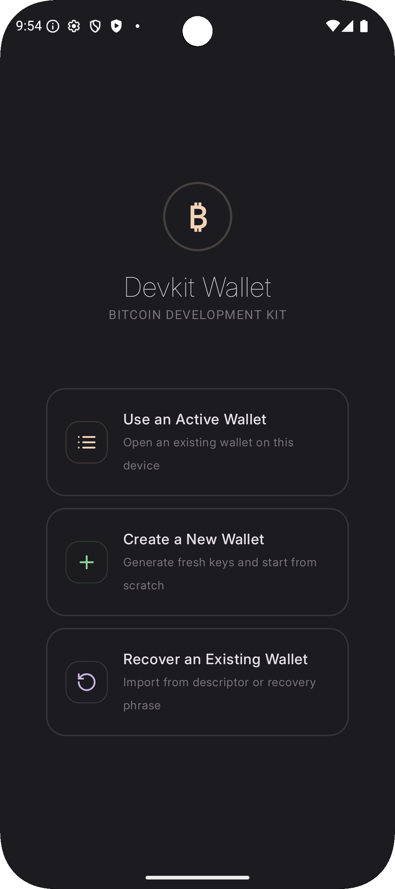

# About the Devkit Wallet

The Devkit Wallet is the Android sample app for the Bitcoin Development Kit. It's a bitcoin wallet that works with the Regtest, Signet, and Testnet4 bitcoin networks.

 

-   ### Onboarding
    
    ---

    

    Onboarding screens.

-   ### Wallet
    
    ---

    

    Wallet screen.

